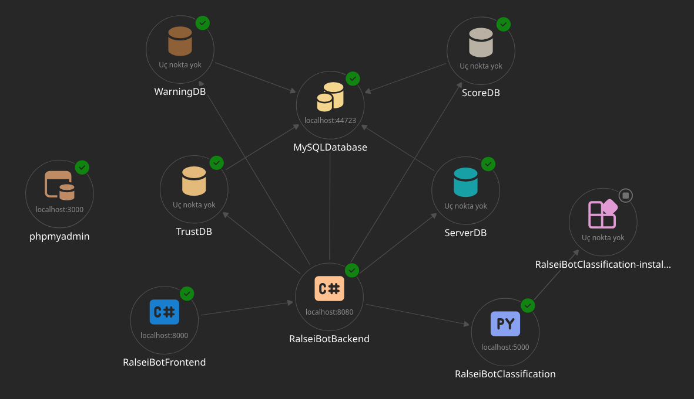

# Ralsei Bot

This is the moderation bot for my Discord Server.

## Sections
### RalseiBot
This is the Aspire Middleware that allows every other component to initialize and have a lifetime.

This section uses C# with Aspire.

### RalseiBot.Backend

This is the backend of the bot, that handles the Discord API, calls to the content filtering service and all of the general data.

This section uses ASP.NET's WebAPI System, configured with JWT Bearer Token Authorization. Along with using the NetCord library for the Discord API Communication.

### RalseiBot.Classification
This is the content filtering service, that checks for NSFW and Offensive messages in any discord channel. It is powered by the `transformers` library provided by HuggingFace.

This section uses Python and FastAPI, for the connection to `RalseiBot.Backend`.

### RalseiBot.Web
This is the frontend of the bot (Control Panel) and it requires admin access to enter. You must configure the specified admin password in an appsettings.json.

This section uses Blazor and ASP.NET with C#.

### MySQL 

MySQL is used for the database portion, and there's a total of 4 databases in charge for different actions.

- WarningDB: This stores the "Warning Count" for each user.
- ScoreDB: This stores the high score for games, for each user.
- ServerDB: This is an automatically configured Database that handles the server configuration for each server.
- TrustDB: This stores trusted users, who will not get kicked when their account is detected as potentially suspicious.

## Stack Diagram
This is the stack of the bot and how they interact with each other.

## Requirements

- Python 3.14
- .NET 10.0

## License

This project's MIT License only covers the code portion of the project. Any asset that is not owned by Thefirey33, will not be covered by the license.

They are rightfully owned by their respective owners.